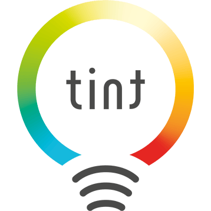

# ioBroker.tint

## Adapter tint dla ioBroker

Steruj inteligentnymi lampami **Müller Licht tint** Zigbee przez bramkę **deCONZ / ConBee**.
Adapter zapewnia pełną kontrolę nad pojedynczymi lampami, grupami i scenami,
oraz dekoduje wszystkie zdarzenia przycisków i koła kolorów pilota Tint.

## Zastrzeżenie

Nazwy **Müller Licht** i **tint** są znakami towarowymi Müller-Licht International GmbH.
Ten adapter jest niezależnym projektem społeczności i nie jest powiązany z Müller-Licht.
Komunikacja odbywa się wyłącznie przez otwarty REST API deCONZ firmy dresden elektronik.

## Funkcje

- **Lampy** – włączanie/wyłączanie, ściemnianie, temperatura barwowa (2000–6500 K), kolor RGB (hex, XY, barwa/nasycenie)
- **Efekty świetlne** – colorloop, sunset, party, worklight, campfire, romance, nightlight
- **Grupy** – sterowanie wszystkimi lampami grupy jednym punktem danych
- **Sceny** – przywoływanie nazwanych scen dla każdej grupy
- **Pilot Tint** – pełne dekodowanie zdarzeń przycisków (krótkie naciśnięcie, przytrzymanie, zwolnienie) i wyboru strefy (1–3 / wszystkie)
- **Koło kolorów** – współrzędne CIE XY i kolor hex z każdej pozycji koła; opcjonalne automatyczne zastosowanie do aktywnej strefy
- **Koło temperatury barwowej** – wartość temperatury barwowej w Kelwinach dla każdego zdarzenia pilota
- **Push w czasie rzeczywistym** – WebSocket deCONZ dla natychmiastowych aktualizacji stanu
- **Polling awaryjny** – konfigurowalny interwał polling REST dla niezawodności
- **Bateria i osiągalność** – monitorowane dla każdego pilota

## Wymagania

- Bramka deCONZ / ConBee (ConBee I/II/III lub RaspBee) z oprogramowaniem deCONZ ≥ 2.x
- Żarówki Müller Licht tint sparowane już z bramką deCONZ
- Klucz API deCONZ (odblokować w aplikacji deCONZ lub interfejsie web Phoscon)
- Node.js ≥ 20

## Konfiguracja

| Parametr | Domyślny | Opis |
|----------|----------|------|
| Adres IP | `192.168.1.100` | Adres IP bramki deCONZ / ConBee |
| Port REST | `80` | Port HTTP REST API deCONZ |
| Port WebSocket | `443` | Port WebSocket dla zdarzeń push deCONZ |
| Klucz API | *(pusty)* | Klucz API deCONZ |
| Interwał polling | `60` | Awaryjny interwał polling REST w sekundach |
| Automatyczne stosowanie koła kolorów | `true` | Automatycznie ustawiać wybrany kolor na aktywnej strefie |
| Czas przejścia | `4` | Domyślny czas przejścia światła w krokach po 100 ms (4 = 400 ms) |
| Watchdog (minuty) | `120` | Limit czasu watchdog; ponowne połączenie po N minutach bez zdarzenia WebSocket |

## Changelog

### 0.1.0 (2026-06-15)
* (ssbingo) Pierwsza wersja: światła, grupy, sceny, pilot Tint z kołem kolorów

## Licencja

MIT License

Copyright (c) 2026 ssbingo <s.sternitzke@online.de>
